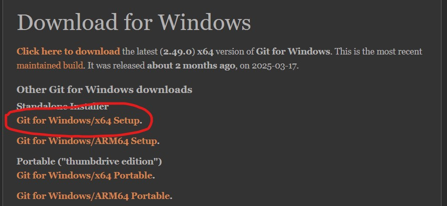
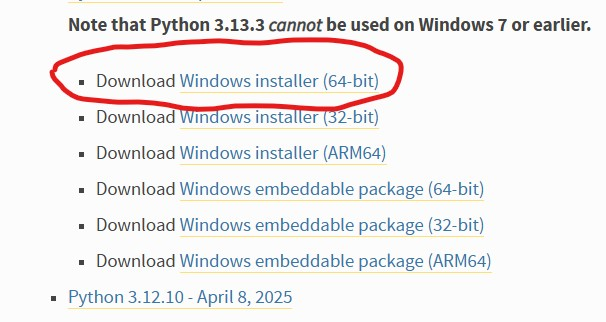
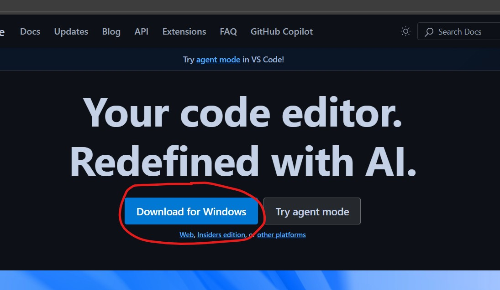

# Day 1 Installations 


We will be installing Winget, Git, Python, VScode, and cloning a repository. Finally, we will open Jupyter notebooks from the cloned repository on VScode.


Welcome to the workshop offered by the Makerspace! You are going to spend the next 7 days learning about encryption, making your own encryption/encodings, and operating on a mesh network in your classroom. This guide will help you get started with the codebase setup, and navigate through the tasks for the workshop. Please follow these instructions carefully.


## Step 0: Install Winget

### Check if you have Winget (a package manager) already installed on your laptop. 

**Check by:**

* Open the Start Menu, search for Command Prompt, and open it.
* Type the following command: where winget

If you get a result such as this:   `C:\Users\<YourUsername>\AppData\Local\Microsoft\WindowsApps\winget.exe
 or   C:\Windows\System32\winget.exe`

then you can move to the next step. 

### If it is not installated: 

1. Go to this link: https://apps.microsoft.com/store/detail/app-installer/9NBLGGH4NNS1

this will open up a page such as below 


2. Click "Install" — this will install the App Installer package, which includes winget.

Verify Installation: 

Open Command Prompt or PowerShell, and type:
> winget --version

You should see output like: v1.x.x.


## Step 1: Install Git 

- ### Check if you have Git already installed on your laptop. 

    **Check by:**
    * Typing the following command on command prompt : 
    > where git

    If you get a result such as this:
    git version 2.43.0.windows.1

    Then Git is already installed, and you can skip to the next step.


- ### If it is not installed: 

    #### **Install Git using Winget** 

    1. Now that you have winget installed, install it using winget on command prompt using the following command: 
    > winget install --id Git.Git -e --source winget

    This installs the official Git for Windows distribution.

    After installation, close and reopen your terminal.
    Verify installation: 
    > git --version

<!--- #### **Option B: Intsall Git Manually**

    1. Go to the official Git for Windows download page:
    https://git-scm.com/download/win and download Git for Windows/x64 Setup.

    

    2. The download should start automatically.

    3. Run the installer and accept the defaults (you can customize if needed).

    After installation, close and reopen your terminal.
    Verify installation: 
    > git --version -->


## Step 2: Install Python

- ### Check if you already have Python installed on your laptop.

    **Check by:**
    * Typing the following command on command prompt : 
    > where python


    If you get a result such as this:
    `C:\Users\YourName\AppData\Local\Programs\Python\Python39\python.exe`
    or `C:\Python39\python.exe`

    Further check the version of the Python that is installed by: 
    > python --version 
    OR 
    >python3 --version`

    If either command returned a version which is higher than 3.10 then you can move to the next step.


- ### If not installed or not the latest version: 

    #### **Install Python via Winget**

    Run this in Command Prompt or PowerShell:
    >winget install --id Python.Python.3 --source winget --exact

    This will install the latest stable version of Python 3.x, typically from the Python Software Foundation.

    After installation, verify: 
    > python --version

<!-- - #### **Option B: Install Python Manually **

    Visit the official Python download page: https://www.python.org/downloads/windows/

    

    (it shows the most recent stable release, e.g., 3.12.3). Scroll to the Download Windows Installer (64-bit) corresponding to that and download it. 

    Run the installer: 
    Check the box that says "Add Python to PATH".
    Then click install Now/

    Once installed, reopen Command Prompt and check: 
    >python --version
-->


## Step 3: Install VSCode 

- ### Check if VS Code is already installed on your laptop

    **Check by:**
    Typing the following command on command prompt : 
    > where code

    If VS Code is installed correctly, you’ll see something like:
    `C:\Users\<YourName>\AppData\Local\Programs\Microsoft VS Code\bin\code.cmd`

    Confim the version by checking
    Further check the version of the VSCode that is installed by: 
    >code --version

    If you see a version like 1.89.1 then VS Code is installed and accessible from the terminal. You can move to the next step.


- ### If VS Code is not installed

    #### **Install via Winget** 
    
    1. Run this in Command Prompt or PowerShell:
    > winget install --id Microsoft.VisualStudioCode --source winget --exact
    
    2. After installation, verify: 
    > code --version

<!-- - #### **Option B: Install VS Code Manually** 

    1. Go to the official download page: https://code.visualstudio.com/

    2. Click "Download for windows" and run the installer. 

    

    3. Make sure you check the box that says:
    "Add to PATH (available after restart)"

    After installation, close and reopen your terminal and test with:
    `code --version` -->


## Step 4: Clone the repository containing the Jupyter notebooks 

If you are familiar with Git, clone the repository. If not, download the zip file from the repository URL, and extract it on your machine.

## Step 5: Navigate to the project 

Here's how you can navigate to the project directory:

- **On Windows:**

  Go to where you have downloaded the zip file and extract all of its contents.
  Now open `Powershell` from Start Menu and follow the instructions below. It renames the directory and opens the python-interface source directory on VS Code.
  ```
  cd [path to]\ysp-esp32-mesh-firmware-main\
  cd ..
  MOVE ysp-esp32-mesh-firmware-main\ ysp-esp32-mesh-firmware\
  cd ysp-esp32-mesh-firmware\Notebooks
  code .
  ```
  You can open this folder in VS-Code or any other IDE of your choice. But make sure you use a terminal to follow the rest of the instructions.
